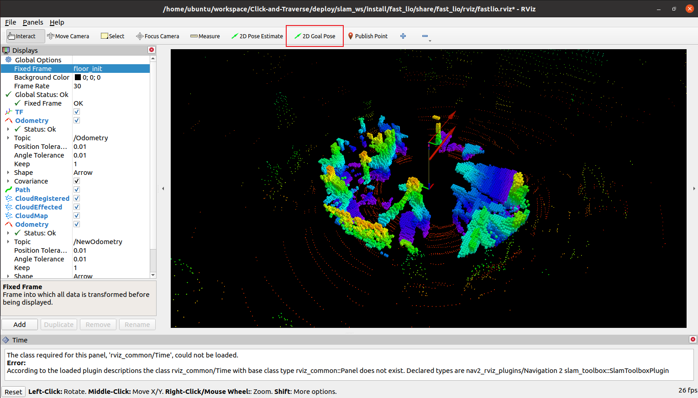

# SLAM-CAT

## Project Structure

The project structure is as follows:

```
slam_ws/
├── README.md                  
├── octomap_py_pkg/              # Python wrapper for OctoMap (used by downstream scripts)
├── src/                       
│   ├── FAST_LIO/                # FAST‑LIO lidar odometry & mapping library
│   ├── ground_segmentation/     # ground segmentation node
│   ├── livox_ros_driver2/     
│   ├── Livox-SDK2/            
│   ├── octomap_mapping/         # octomap_server and related mapping tools
│   ├── octomap_msgs/            # custom ROS message/service definitions
│   ├── octomap_ros/             # OctoMap‑ROS conversion utilities
│   ├── octomap_rviz_plugins/  
│   └── …                      
├── build/                       # build artefacts (generated by colcon)
├── install/                     # install space (generated by colcon)
└── log/                         # build logs (generated by colcon)
```

Below directories are created automatically when building the workspace; only `src/` and `octomap_py_pkg/` are regularly modified by developers.

Prepare a new env named **deploy_cat** following the deployment section of [Click-and-Traverse](https://github.com/GalaxyGeneralRobotics/Click-and-Traverse-SLAM).

### install

```bash
source /opt/ros/foxy/setup.bash
git clone https://github.com/GalaxyGeneralRobotics/Click-and-Traverse-SLAM.git slam_ws
cd slam_ws
git pull --recurse-submodules
cd lidar_ws
colcon build --symlink-install
conda activate deploy_cat
cd ../octomap_py_pkg
pip install -e .
```

### usage

```bash
source /opt/ros/foxy/setup.bash
source slam_ws/lidar_ws/install/setup.bash
```

Please refer to `scripts/exp_dis_pf/deploy_real_gf.py:84-131` for more details.

We modify the default config file as follows for the mid360 deployment (suitable for the G1 robot):

- `slam_ws/lidar_ws/src/FAST_LIO/config/mid360.yaml`
- `slam_ws/lidar_ws/src/octomap_mapping/octomap_server/launch/octomap_mapping.launch.xml`

The result is as follows, user can use **2D Goal Pose** to click the target position:


